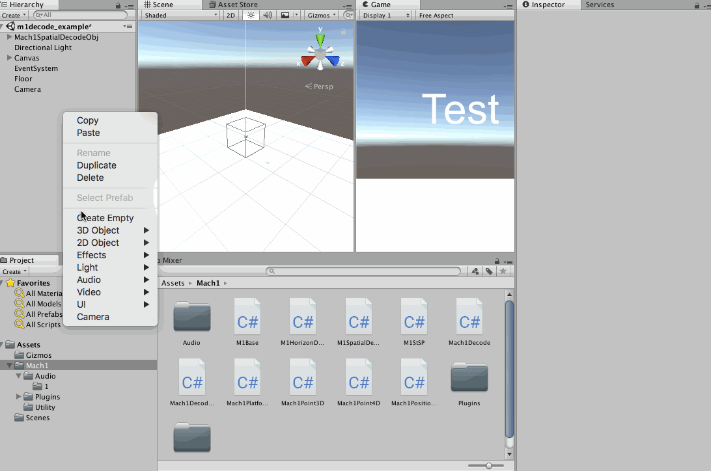
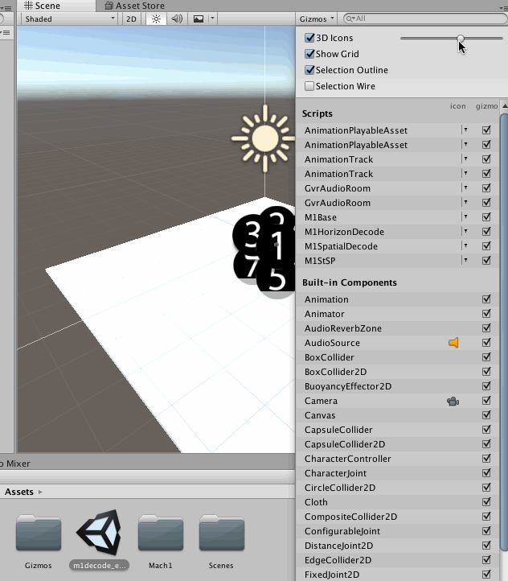

## Mach1 Unity Examples

#### Current Audio Formats
##### _all algorithms contained inside `libMach1Decode` & `libMach1DecodePositional`, all functions/features inside `M1Base`_
 - M1Spatial [Multichannel] / 8Channel [M1SpatialDecode.cs] {Yaw,Pitch,Roll + Positional}
 - M1Horizon [Multichannel] / 4Channel [M1HorizonDecode.cs] {Yaw + Positional}
 - M1StSP [Stereo Spatializer] / 2Channel [M1StSP.cs] {Yaw, Pitch, Roll + Positional}
 - M1Horizon [Pair] / 4Pair [DirectionalSound.cs][*DEPRECATED*]

#### Install:
- Import the .unitypackage via the Assets>Import Package>Custom Package prompt.
- Add needed decoding component and add it to an object

- Add the split channels from your Mach1 Spatial mix into the audio or link to it via the `External Audio Filename` into either of the `Main` audio fields
- Setup as needed and place parent object where needed and to the scale needed
 _turn on the Draw Helpers to assist with this in editor_
- If channel gizmo indicators are too large, shrink via the following:

_It is recommended to increase your project's `ProjectSettings` `Max Real Voices` count to accomondate the maximum number of consecutive M1 Spatial objects in your project (by a multiple of 8 or 16)._

#### Further Use:
 - All Mach1 Spatial audio formats are contained in the `libMach1Decode` & `libMach1DecodePositional` as functions that can be called with custom use. Simply return those coefficients as audio source volume multipliers to use the desired format, reference the `M1SpatialDecode.cs` as an example. 

#### Advanced Settings:
 - `Use Closest Point Rotation Mute Inside` when active the positional rotation of the Mach1 mix will rotate along the closest point of the closest plane to the camera. This is to have it rotate along a plane instead of a point.
 - `BlendMode` function is an experimental feature that allows pre-rendered room modeling by using the player's positional data along with orientation data to correctly mix between a pre-rendered center soundscape and a pre-rendered bound/wall soundscape. 

Please contact `dylan@mach1studios.com` for references on best mixing practices and use.